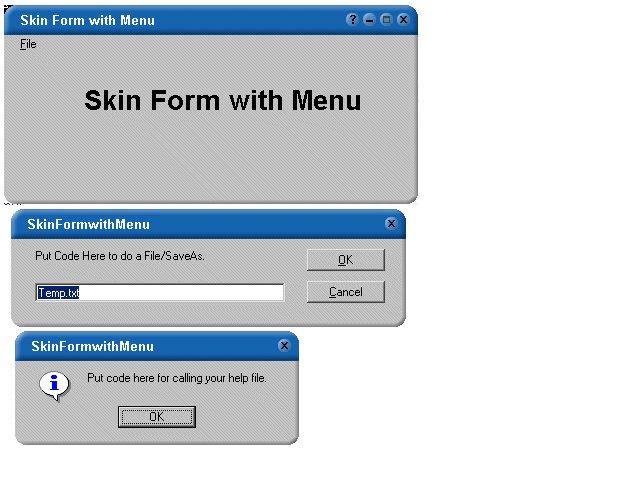



## SkinFormWithMenu

### Description

This is an enhancement of the code that Rob Wright submitted.

http://www.planetsourcecode.com/xq/ASP/txtCodeId.26858/lngWId.1/qx/vb/scripts/ShowCode.htm

I've updated it to include an example of how to use menus with Skinned forms as well as including code for Skinned Message Boxes and Input Boxes.
 
### More Info
 

             |
---                |---
**Submitted On**   |2001-10-01 16:58:50
**By**             |[Tim Markoski](https://github.com/Planet-Source-Code/PSCIndex/blob/master/ByAuthor/tim-markoski.md)
**Level**          |Intermediate
**User Rating**    |4.8 (43 globes from 9 users)
**Compatibility**  |VB 4\.0 \(32\-bit\), VB 5\.0, VB 6\.0
**Category**       |[VB function enhancement](https://github.com/Planet-Source-Code/PSCIndex/blob/master/ByCategory/vb-function-enhancement__1-25.md)
**World**          |[Visual Basic](https://github.com/Planet-Source-Code/PSCIndex/blob/master/ByWorld/visual-basic.md)
**Archive File**   |[SkinFormWi273321012001\.zip](https://github.com/Planet-Source-Code/tim-markoski-skinformwithmenu__1-27716/archive/master.zip)

